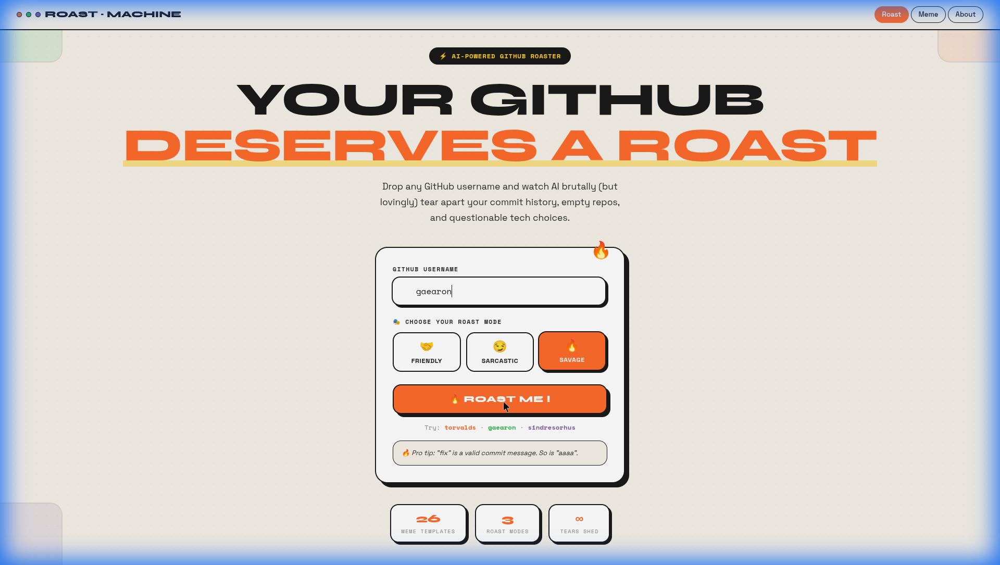
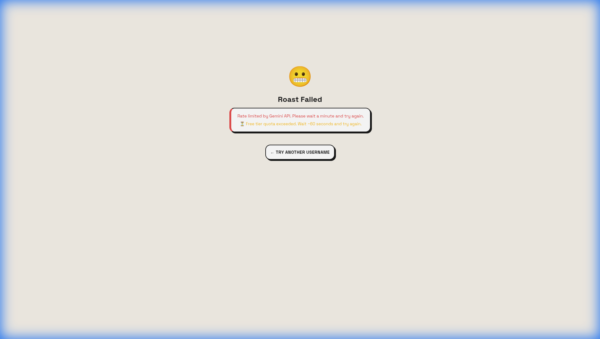

<br># 🔥 GitHub Roast Machine

> Drop any GitHub username and watch AI brutally (but lovingly) tear apart your commit history, empty repos, and questionable tech choices.


---

## ✨ Features

- **🤖 AI-Powered Roasts** — Gemini 2.0 analyzes your GitHub profile and delivers savage, personalized roast lines
- **3 Roast Modes** — Friendly 🤝, Sarcastic 😏, or Savage 🔥
- **📊 Career Score** — Get rated 1-100 with a custom archetype badge
- **🎨 Meme Editor** — 26 viral meme templates with AI-generated captions + Canvas text overlay
- **🃏 Roast Card** — Shareable card with your avatar, archetype, banger quote, and score
- **📤 Share** — One-click sharing to X (Twitter) and LinkedIn

---

## 📸 Screenshots

### Landing Page — Retro Vintage UI


### Username Input + Mode Selection


### Error Handling


---

## 🏗️ Tech Stack

| Layer | Tech |
|-------|------|
| Frontend | React + Vite |
| Backend | Express.js |
| AI | Google Gemini 2.0 Flash |
| Styling | Vanilla CSS (Neubrutalism) |
| Meme Rendering | Canvas API |
| Card Export | html2canvas |

---

## 🚀 Quick Start

### 1. Clone
```bash
git clone https://github.com/DhirajB05/GitHub_Roast.git
cd GitHub_Roast/Round\ 01/github-roast
```

### 2. Install
```bash
npm install
cd server && npm install && cd ..
```

### 3. Add API Key
```bash
# Create server/.env
echo "GEMINI_API_KEY=your_key_here" > server/.env
echo "PORT=3001" >> server/.env
```
Get a free key at [aistudio.google.com](https://aistudio.google.com)

### 4. Run
```bash
# Terminal 1 — Backend
cd server && npx dotenvx run -- node index.js

# Terminal 2 — Frontend
npm run dev
```

Open [http://localhost:5173](http://localhost:5173) 🔥

---

## 📁 Project Structure

```
github-roast/
├── src/
│   ├── pages/
│   │   ├── Landing.jsx      # Hero + input + mode buttons
│   │   ├── Loading.jsx      # Terminal animation
│   │   ├── Results.jsx      # Roast output + score ring
│   │   ├── MemeEditor.jsx   # 26 templates + Canvas editor
│   │   └── RoastCard.jsx    # Shareable card export
│   ├── App.jsx              # Router
│   └── index.css            # Full retro design system
├── server/
│   ├── index.js             # Express server
│   └── routes/
│       ├── github.js        # GitHub API fetcher
│       ├── roast.js         # Gemini roast generator
│       └── meme.js          # AI meme captions
└── screenshots/
```

---

## 🎨 Design System

Retro / Neubrutalist aesthetic inspired by vintage web design:
- **Background**: Warm cream `#fdfcf0` with dot-pattern overlay
- **Borders**: Thick black `3px` with offset box-shadows
- **Colors**: Orange `#ff6b35` · Green `#7cb342` · Purple `#9c77db`
- **Fonts**: Syne (headings) · Space Grotesk (body) · Space Mono (labels)

---

## 📝 License

MIT — roast responsibly.

---

Built with 🔥 and questionable life decisions.
