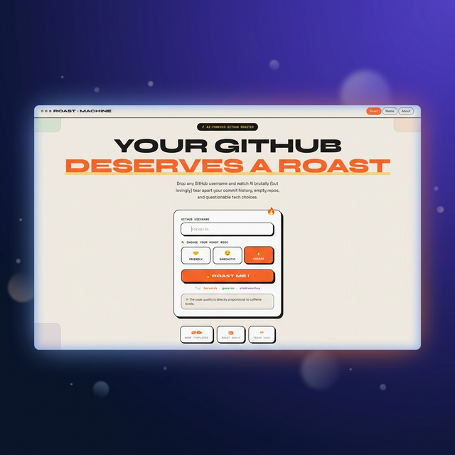
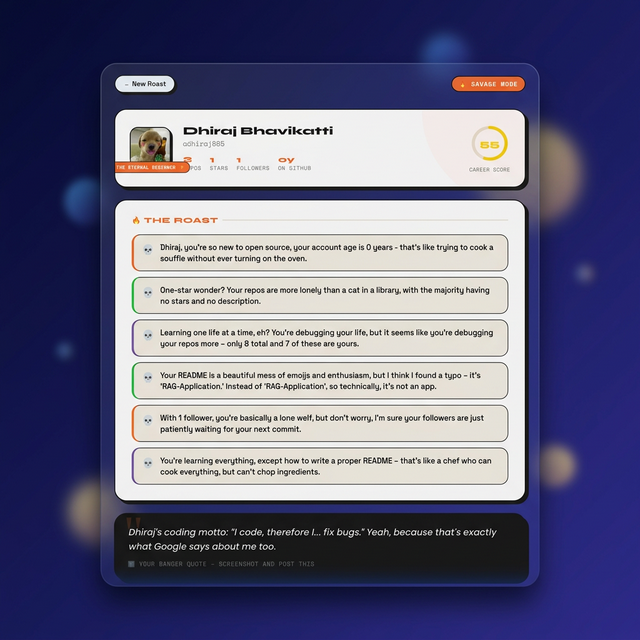
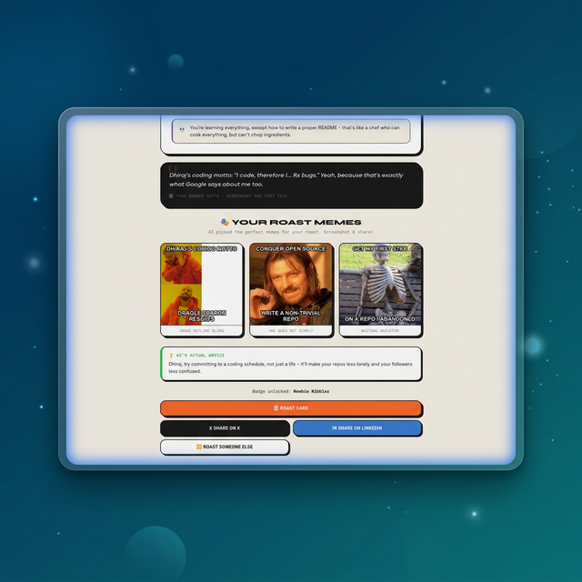

<](https://vercel.com/new/clone?repository-url=https%3A%2F%2Fgithub.com%2FDhirajB05%2FOpenSprint&root-directory=Round%2001/github-roast)



Drop any GitHub username and watch AI brutally (but lovingly) tear apart your commit history, empty repos, and questionable tech choices.

</div>

---

## ✨ Features

- 🔥 **AI-Powered Roasts** — 3 modes: Friendly, Sarcastic, and Savage
- 🎭 **Auto-Generated Memes** — AI picks the perfect viral meme templates and writes custom captions based on your roast
- 🃏 **Shareable Roast Cards** — Download and share your roast as a styled card
- ⚡ **Smart Caching** — In-memory cache (24h TTL) prevents duplicate API calls, with optional Vercel KV (Redis) support
- 📊 **Career Score** — AI rates your GitHub career out of 100
- 🏷️ **Developer Archetypes** — Get classified as "The Eternal Beginner", "Fork Collector", "Tutorial Hoarder" and more
- 🐦 **Social Sharing** — One-click share to X (Twitter) and LinkedIn

---

## 📸 Screenshots

### Roast Results & Career Score


### Auto-Generated Memes


---

## 🛠️ Tech Stack

| Layer | Technology |
|-------|-----------|
| **Frontend** | React 19, Vite 7, React Router |
| **Backend** | Express.js (Node.js) |
| **AI** | Groq API (Llama 3.1 8B Instant) |
| **Caching** | In-memory (default) / Vercel KV Redis (production) |
| **Styling** | Vanilla CSS with retro design system |
| **Deployment** | Vercel |

---

## 🚀 Quick Start (Local Development)

### Prerequisites
- Node.js 18+
- [Groq API Key](https://console.groq.com/keys) (free)

### 1. Clone the repo
```bash
git clone https://github.com/DhirajB05/OpenSprint.git
cd "OpenSprint/Round 01/github-roast"
```

### 2. Install dependencies
```bash
# Frontend
npm install

# Backend
cd server
npm install
```

### 3. Configure environment
```bash
cp server/.env.example server/.env
```

Edit `server/.env` and add your keys:
```env
GROQ_API_KEY=gsk_your_groq_api_key_here
GITHUB_TOKEN=your_github_pat_optional
PORT=3001
```

### 4. Start development servers
```bash
# Terminal 1: Backend
cd server && node index.js

# Terminal 2: Frontend
npm run dev
```

Open **http://localhost:5173** and roast away!

---

## 🌐 Deploy to Vercel

### One-Click Deploy
1. Click the **Deploy with Vercel** button above
2. Set the Root Directory to `Round 01/github-roast`
3. Add environment variables in Vercel dashboard:
   - `GROQ_API_KEY` — Your Groq API key
   - `GITHUB_TOKEN` — (optional) GitHub PAT for higher rate limits

### Manual Deploy
```bash
npm i -g vercel
cd "Round 01/github-roast"
vercel --prod
```

### Optional: Enable Redis Caching
For production caching with Vercel KV:
1. Add a KV (Redis) store from [Vercel Marketplace](https://vercel.com/marketplace?category=storage&search=redis)
2. The `KV_REST_API_URL` and `KV_REST_API_TOKEN` env vars will be auto-configured
3. The app auto-detects and uses Redis when available

---

## 📁 Project Structure

```
github-roast/
├── src/
│   ├── pages/
│   │   ├── Landing.jsx     # Home page with username input
│   │   ├── Loading.jsx     # Retro terminal loading animation
│   │   ├── Results.jsx     # Roast results + inline memes
│   │   └── RoastCard.jsx   # Downloadable roast card
│   ├── App.jsx             # Router setup
│   └── index.css           # Full retro design system
├── server/
│   ├── index.js            # Express server
│   ├── routes/
│   │   ├── roast.js        # Groq AI roast generation + caching
│   │   ├── meme.js         # Auto meme picker + caption gen
│   │   └── github.js       # GitHub profile data fetcher
│   └── .env.example        # Environment template
├── screenshots/            # README mockup images
└── package.json
```

---

## 🎨 Design System

The UI uses a custom **retro/neubrutalist** design system:

- **Typography**: Syne (headings), Space Grotesk (body), Space Mono (code)
- **Color Palette**: Cream (#F5F0E8), Orange (#FF6B2C), Green (#2DB84B), Purple (#7B5EA7)
- **Elements**: Thick borders, box-shadows, rounded shapes, playful animations
- **Meme Text**: Impact font with multi-layer text-shadow outline

---

## 📊 API Architecture

```
User enters username
       │
       ▼
  [GitHub API] ──→ Fetch profile, repos, README
       │
       ▼
  [Cache Check] ──→ Hit? Return cached roast instantly
       │ Miss
       ▼
  [Groq API] ──→ Generate roast (Llama 3.1 8B)
       │
       ├──→ Save to cache (24h TTL)
       │
       ▼
  [Groq API] ──→ Pick 3 memes + write captions
       │
       ▼
  [Results Page] ──→ Display roast + memes + share options
```

---

## 🔑 Environment Variables

| Variable | Required | Description |
|----------|----------|-------------|
| `GROQ_API_KEY` | ✅ | Free API key from [console.groq.com](https://console.groq.com) |
| `GITHUB_TOKEN` | ❌ | GitHub PAT for higher API rate limits |
| `PORT` | ❌ | Server port (default: 3001) |
| `KV_REST_API_URL` | ❌ | Vercel KV Redis URL (auto-set by Vercel) |
| `KV_REST_API_TOKEN` | ❌ | Vercel KV Redis token (auto-set by Vercel) |

---

## 📝 License

MIT © [DhirajB05](https://github.com/DhirajB05)

---

<div align="center">
  <strong>Built with 🔥 and questionable design choices</strong>
  <br>
  <sub>If this roasted you too hard, remember: it's just an AI, and it's probably right.</sub>
</div>
]]>
